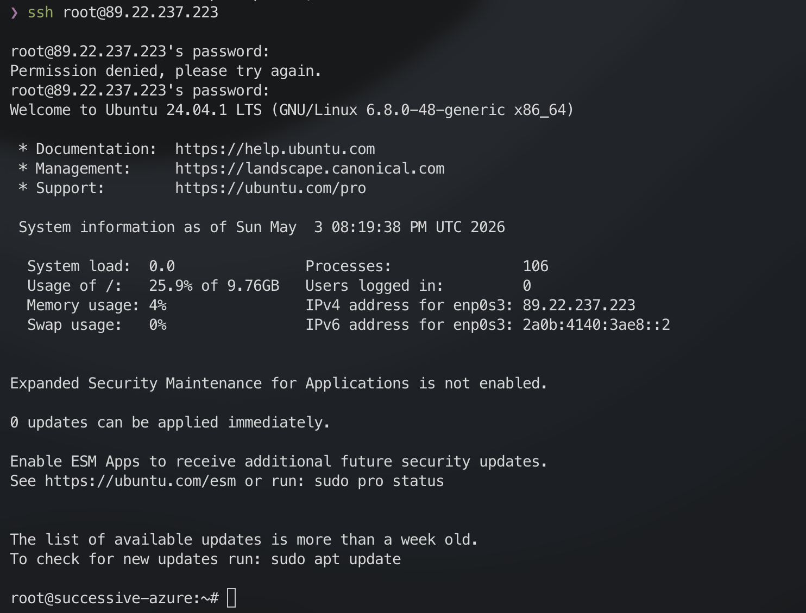
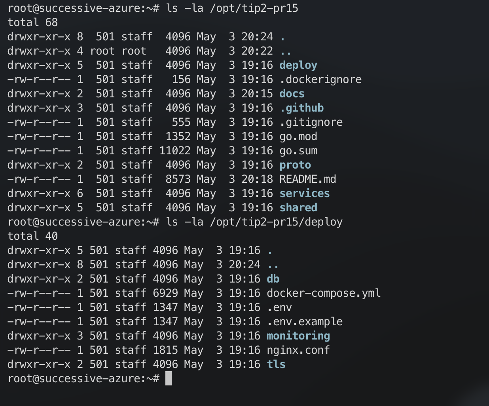
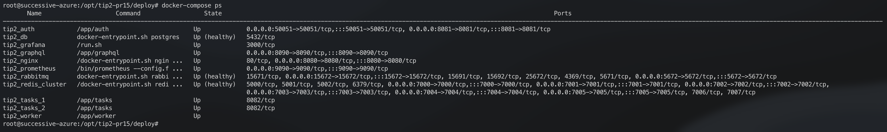
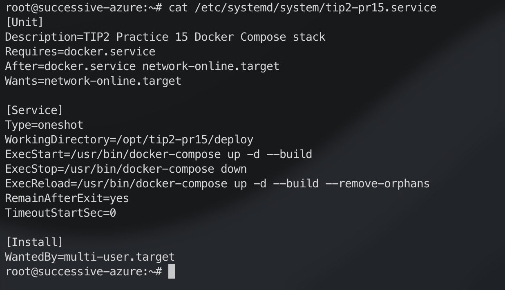
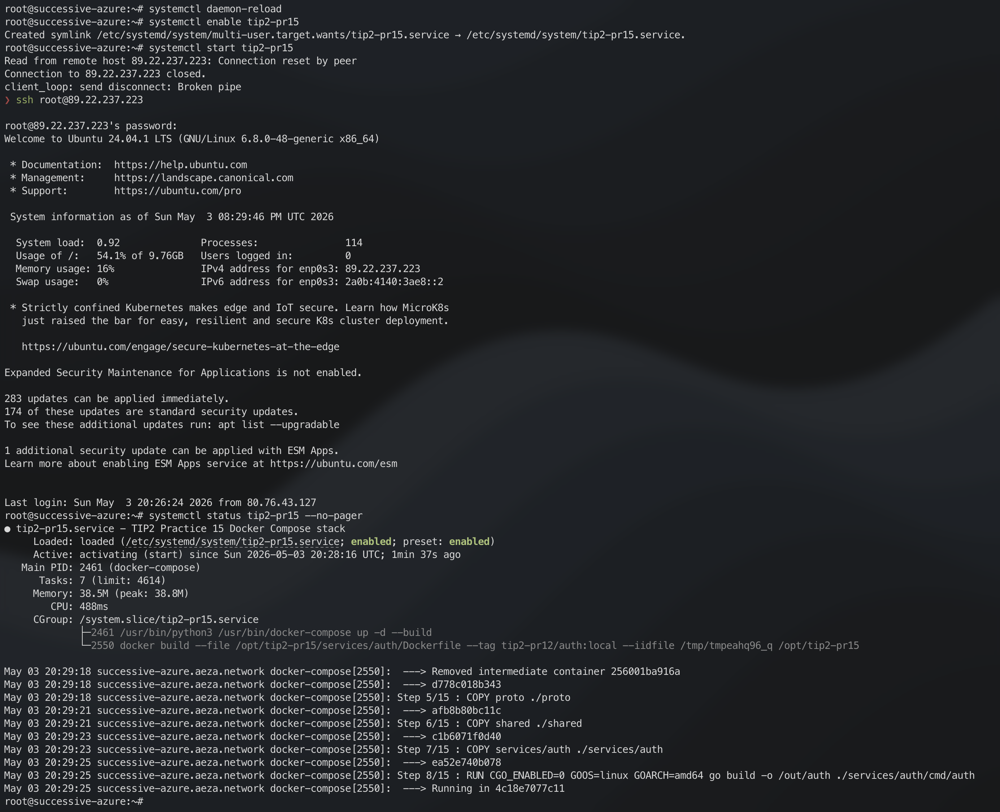
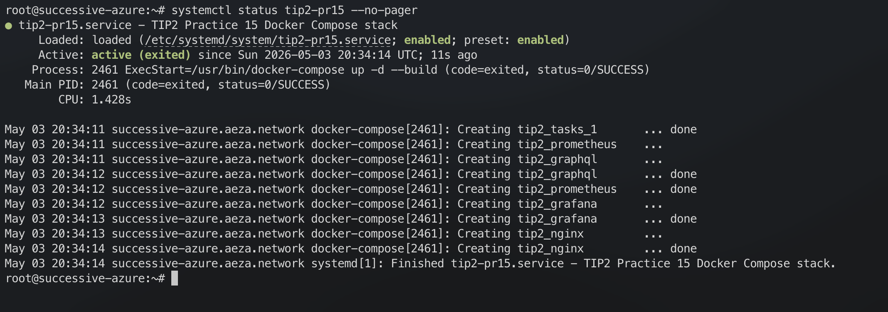
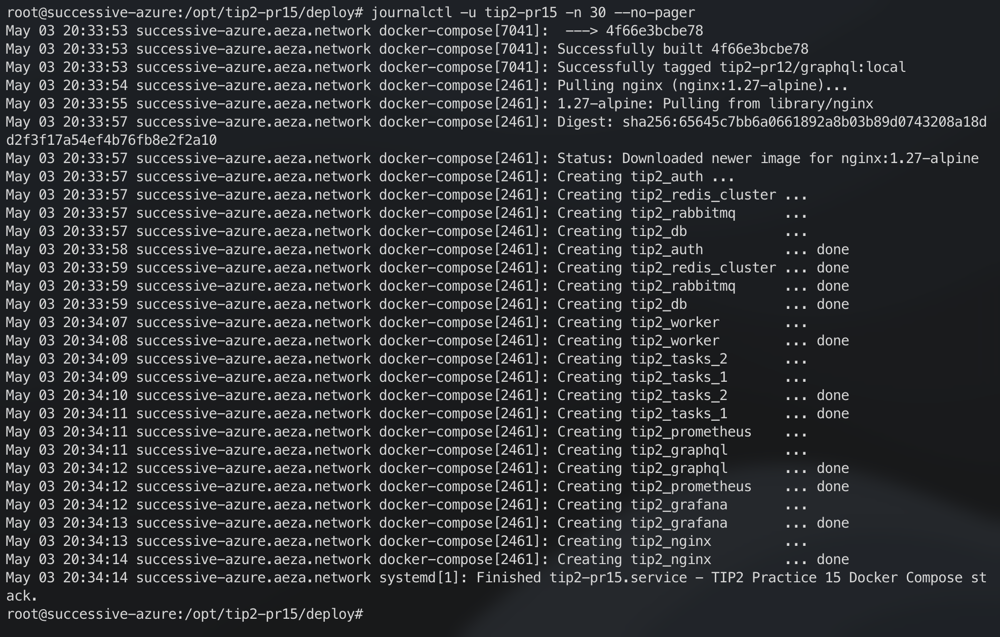
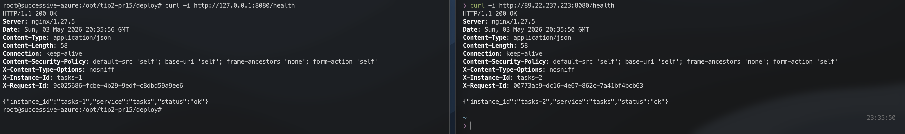
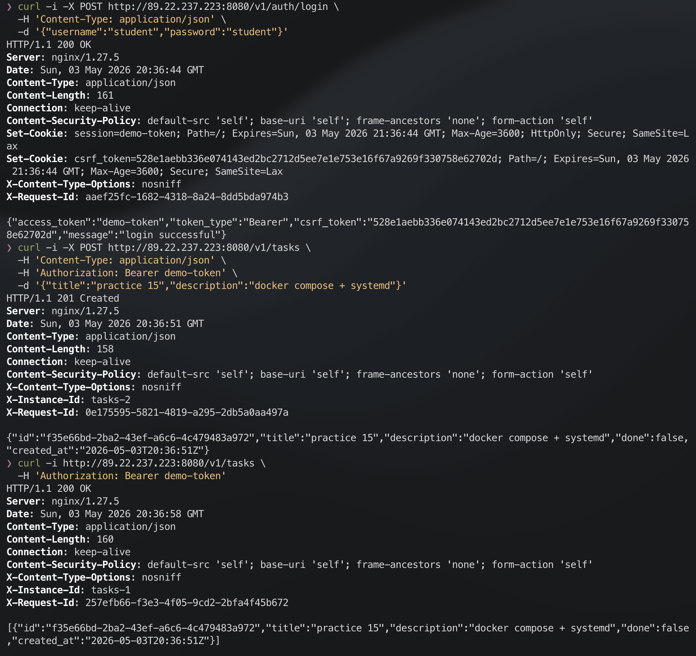

# Практическое занятие №15

## Рузин Иван Александрович ЭФМО-01-25

## Деплой приложения на VPS. Настройка systemd

## Схема деплоя

```text
локальный проект -> rsync/scp на VPS -> docker compose build/up ->
systemd управляет compose-стеком -> сервис доступен через NGINX
```

В работе выбран вариант B: контейнерный деплой через Docker Compose. `systemd`
используется не для запуска отдельного Go-бинарника, а для управления всем
стеком приложения.

## 1. IP/хост VPS и подключение по SSH

VPS:

```text
89.22.237.223
```

Подключение:

```bash
ssh root@89.22.237.223
```

Скриншот:



## 2. Размещение приложения на VPS

Проект размещён в директории:

```bash
/opt/tip2-pr15
```

Рабочая директория Docker Compose:

```bash
/opt/tip2-pr15/deploy
```

Проверка структуры:

```bash
ls -la /opt/tip2-pr15
ls -la /opt/tip2-pr15/deploy
```

Скриншот:



Основные файлы деплоя:

- `deploy/docker-compose.yml` - описание контейнеров;
- `deploy/.env` - переменные окружения;
- `deploy/nginx.conf` - reverse proxy;
- `deploy/db/init.sql` - инициализация таблицы `tasks`;
- `/etc/systemd/system/tip2-pr15.service` - unit-файл для управления стеком.

## 3. Состав контейнерного стека

В Docker Compose поднимаются:

- `db` - PostgreSQL;
- `redis-cluster` - Redis Cluster;
- `rabbitmq` - RabbitMQ;
- `auth` - сервис авторизации;
- `tasks_1`, `tasks_2` - два экземпляра сервиса задач;
- `worker` - обработчик фоновых задач;
- `prometheus` - сбор метрик;
- `grafana` - dashboard;
- `graphql` - GraphQL gateway;
- `nginx` - reverse proxy.

Проверка контейнеров:

```bash
cd /opt/tip2-pr15/deploy
docker compose ps
```

Скриншот:



## 4. Systemd unit

Unit-файл:

```bash
/etc/systemd/system/tip2-pr15.service
```

Содержимое:

```ini
[Unit]
Description=TIP2 Practice 15 Docker Compose stack
Requires=docker.service
After=docker.service network-online.target
Wants=network-online.target

[Service]
Type=oneshot
WorkingDirectory=/opt/tip2-pr15/deploy
ExecStart=/usr/bin/docker-compose up -d --build
ExecStop=/usr/bin/docker-compose down
ExecReload=/usr/bin/docker-compose up -d --build --remove-orphans
RemainAfterExit=yes
TimeoutStartSec=0

[Install]
WantedBy=multi-user.target
```

Пояснение параметров:

- `Requires=docker.service` - стек зависит от Docker;
- `After=docker.service network-online.target` - запуск после Docker и сети;
- `WorkingDirectory=/opt/tip2-pr15/deploy` - директория с `docker-compose.yml`;
- `ExecStart` - сборка и запуск контейнеров;
- `ExecStop` - остановка и удаление контейнеров стека;
- `ExecReload` - пересборка и обновление контейнеров;
- `RemainAfterExit=yes` - unit остаётся активным после успешного выполнения `docker compose up -d`.

Скриншот unit-файла:



## 5. Запуск через systemd

Команды:

```bash
systemctl daemon-reload
systemctl enable tip2-pr15
systemctl start tip2-pr15
systemctl status tip2-pr15 --no-pager
```

Скриншот:





## 6. Логи через journalctl

Команда:

```bash
journalctl -u tip2-pr15 -n 30 --no-pager
```

Скриншот:



Дополнительно логи конкретного сервиса:

```bash
cd /opt/tip2-pr15/deploy
docker compose logs --tail=50 tasks_1
docker compose logs --tail=50 nginx
```

## 7. Проверка доступности сервиса

Через NGINX на VPS:

```bash
curl -i http://127.0.0.1:8080/health
```

С локальной машины:

```bash
curl -i http://89.22.237.223:8080/health
```

Ожидаемый ответ:

```json
{"instance_id":"tasks-1","service":"tasks","status":"ok"}
```

или:

```json
{"instance_id":"tasks-2","service":"tasks","status":"ok"}
```

Скриншот:



## 8. Проверка API

Логин:

```bash
curl -i -X POST http://89.22.237.223:8080/v1/auth/login \
  -H 'Content-Type: application/json' \
  -d '{"username":"student","password":"student"}'
```

Создание задачи:

```bash
curl -i -X POST http://89.22.237.223:8080/v1/tasks \
  -H 'Content-Type: application/json' \
  -H 'Authorization: Bearer demo-token' \
  -d '{"title":"practice 15","description":"docker compose + systemd"}'
```

Получение списка задач:

```bash
curl -i http://89.22.237.223:8080/v1/tasks \
  -H 'Authorization: Bearer demo-token'
```

Скриншот:



## 9. Обновление версии

Обновление выполняется пересинхронизацией проекта на VPS и перезапуском unit:

```bash
rsync -av --exclude='.git' ./ root@89.22.237.223:/opt/tip2-pr15/
ssh root@89.22.237.223
systemctl reload tip2-pr15
docker compose -f /opt/tip2-pr15/deploy/docker-compose.yml ps
```

`ExecReload` пересобирает изменённые Docker-образы и перезапускает контейнеры.

## 10. Откат

Минимальный откат:

```bash
cd /opt/tip2-pr15
git checkout <previous_commit>
systemctl reload tip2-pr15
```

Если проект переносился без Git, откат выполняется возвратом предыдущей копии
директории `/opt/tip2-pr15` и повторным запуском:

```bash
systemctl restart tip2-pr15
```

## 11. Контрольные вопросы

### Зачем нужен systemd и чем он лучше запуска в screen/tmux?

`systemd` обеспечивает автозапуск после перезагрузки VPS, единое управление
сервисом, интеграцию с журналом логов и корректную остановку. `screen` и `tmux`
подходят для ручного запуска, но не являются системой управления сервисами.

### Почему не стоит запускать сервис от root?

При компрометации приложения злоумышленник получает права процесса. Если сервис
работает от `root`, ущерб максимальный. В контейнерном варианте процессы
изолированы контейнерами, но принцип минимальных привилегий всё равно остаётся
обязательным.

### Зачем хранить env-конфиг отдельно от кода?

Переменные окружения содержат пароли, адреса сервисов и настройки окружения. Их
нельзя жёстко зашивать в код, потому что код переносится между окружениями и
может попасть в публичный репозиторий.

### Как посмотреть логи сервиса, если он упал?

Для unit:

```bash
journalctl -u tip2-pr15 -n 100 --no-pager
```

Для контейнеров:

```bash
cd /opt/tip2-pr15/deploy
docker compose logs --tail=100
```

### Что даёт Restart=always и RestartSec?

`Restart=always` перезапускает сервис после падения. `RestartSec` задаёт паузу
перед перезапуском. В этой работе перезапуск отдельных контейнеров задан в
`docker-compose.yml` через `restart: unless-stopped`, а `systemd` отвечает за
запуск всего compose-стека.
