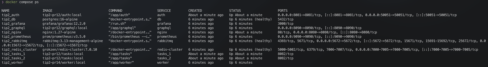
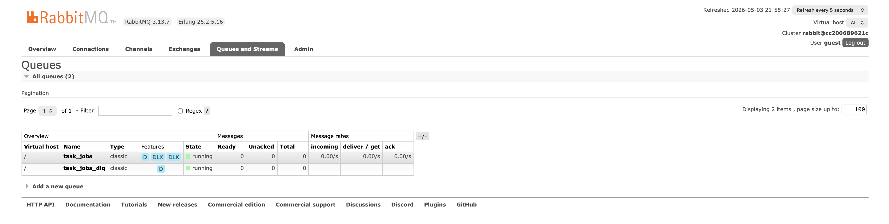
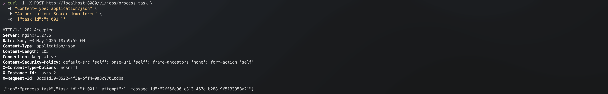
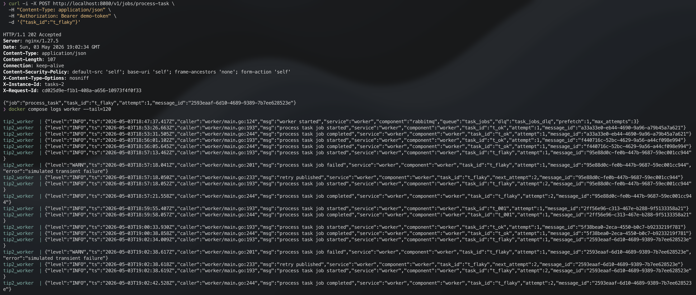
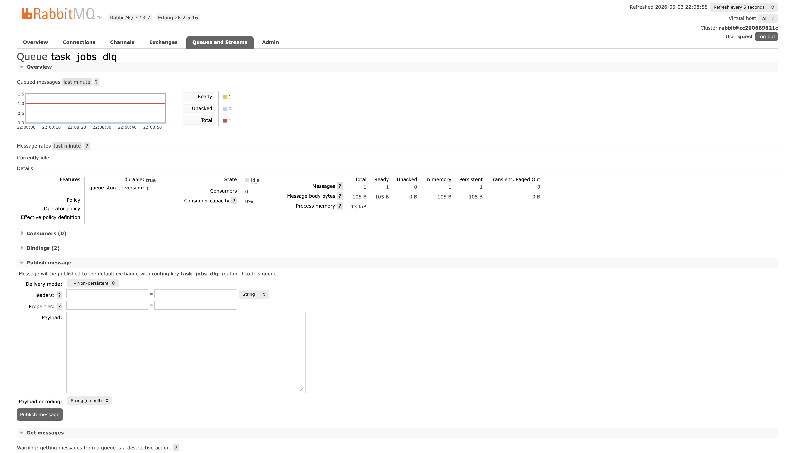
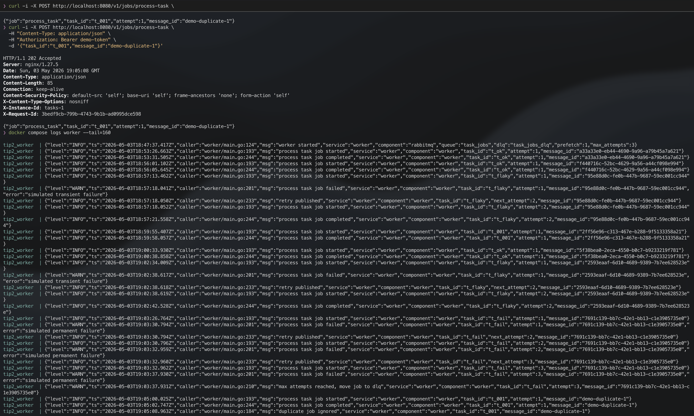
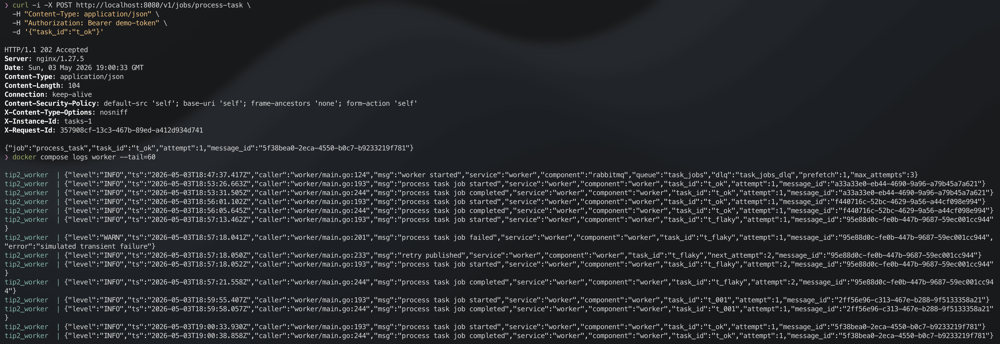
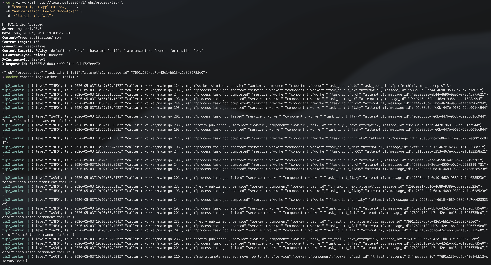

# Практическое занятие №15

## Рузин Иван Александрович ЭФМО-01-25

### Деплой приложения на VPS. Настройка systemd

## Запуск

```bash
cd deploy
cp .env.example .env
docker compose up -d --build
```

Проверка контейнеров:

```bash
docker compose ps
```



## 1. Очереди

В работе используются две очереди RabbitMQ:

- `task_jobs` - основная очередь задач;
- `task_jobs_dlq` - очередь сообщений, которые не удалось обработать.

Для dead-letter маршрутизации используется exchange `task_jobs_dlx`. Основная
очередь объявляется с аргументами:

```go
args := amqp.Table{
    "x-dead-letter-exchange":    dlxName,
    "x-dead-letter-routing-key": dlqName,
}
```

Если worker делает `Nack(false, false)`, RabbitMQ переносит сообщение в `task_jobs_dlq`.

Настройки находятся в `deploy/.env`:

```env
QUEUE_NAME=task_jobs
DLX_NAME=task_jobs_dlx
DLQ_NAME=task_jobs_dlq
WORKER_PREFETCH=1
MAX_ATTEMPTS=3
PROCESSING_MIN_MS=2000
PROCESSING_MAX_MS=5000
```



## 2. Формат job-сообщения

Endpoint для постановки задачи:

```http
POST /v1/jobs/process-task
```

Пример запроса:

```bash
curl -i -X POST http://localhost:8080/v1/jobs/process-task \
  -H "Content-Type: application/json" \
  -H "Authorization: Bearer demo-token" \
  -d '{"task_id":"t_001"}'
```

В очередь отправляется JSON:

```json
{
  "job": "process_task",
  "task_id": "t_001",
  "attempt": 1,
  "message_id": "uuid"
}
```

Поля:

- `job` - тип задачи;
- `task_id` - идентификатор задачи;
- `attempt` - номер попытки обработки;
- `message_id` - ключ идемпотентности.



## 3. Retry policy

Реализован простой вариант retry через payload:

- первая публикация создаёт `attempt = 1`;
- при ошибке worker увеличивает `attempt`;
- если `attempt < MAX_ATTEMPTS`, сообщение публикуется обратно в `task_jobs`;
- исходное сообщение подтверждается через `Ack`;
- если лимит попыток достигнут, worker вызывает `Nack(false, false)`, и сообщение уходит в DLQ.

Ошибки для демонстрации:

- `t_flaky` - падает на первой попытке, проходит на второй;
- `t_fail` - падает всегда и после 3 попыток попадает в DLQ;
- любой `task_id`, который заканчивается на `3`, тоже считается ошибочным.

Между попытками есть имитация тяжёлой обработки: sleep от `PROCESSING_MIN_MS` до
`PROCESSING_MAX_MS`.

Проверка retry:

```bash
curl -i -X POST http://localhost:8080/v1/jobs/process-task \
  -H "Content-Type: application/json" \
  -H "Authorization: Bearer demo-token" \
  -d '{"task_id":"t_flaky"}'
```

Проверка DLQ:

```bash
curl -i -X POST http://localhost:8080/v1/jobs/process-task \
  -H "Content-Type: application/json" \
  -H "Authorization: Bearer demo-token" \
  -d '{"task_id":"t_fail"}'
```





## 4. Идемпотентность

Ключ идемпотентности - `message_id`.

Worker хранит обработанные `message_id` в памяти:

```go
type processedStore struct {
    ids map[string]struct{}
}
```

Перед обработкой worker проверяет, был ли такой `message_id` раньше. Если был,
сообщение считается дублем, повторная работа не выполняется, worker сразу делает
`Ack`.

Для демонстрации дубля можно отправить одинаковый `message_id` два раза:

```bash
curl -i -X POST http://localhost:8080/v1/jobs/process-task \
  -H "Content-Type: application/json" \
  -H "Authorization: Bearer demo-token" \
  -d '{"task_id":"t_001","message_id":"demo-duplicate-1"}'
```



## 5. Демонстрация логами

Успешная обработка:

```bash
curl -i -X POST http://localhost:8080/v1/jobs/process-task \
  -H "Content-Type: application/json" \
  -H "Authorization: Bearer demo-token" \
  -d '{"task_id":"t_ok"}'
```



Несколько retry:


Попадание в DLQ:



## Контрольные вопросы

**Чем job queue отличается от event queue?**  
Event queue передаёт уведомление о факте события. Job queue хранит задачу,
которую consumer должен реально выполнить.

**Почему очереди часто работают как at-least-once?**  
Сообщение может быть доставлено повторно, если consumer выполнил работу, но не
успел отправить `Ack`.

**Как DLQ помогает эксплуатации?**  
DLQ отделяет проблемные сообщения от основной очереди. Их можно посмотреть,
проанализировать и переобработать вручную.

**Почему retry нельзя делать бесконечно?**  
Бесконечные retry забивают очередь и тратят ресурсы на сообщение, которое может
никогда не обработаться.

**Что такое идемпотентность?**  
Это свойство обработчика не выполнять одну и ту же работу повторно для одного `message_id`.
